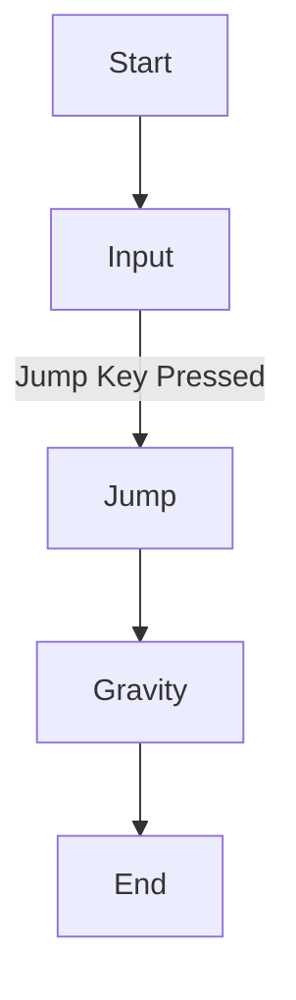

# Markdown Formatting Examples
## Headings
### This a SubSub Heading
This section was made by adding a `### ` at the start of the line
Locate the script named: `PlayerController.cs`

```
jkbskjhbdvkjhbvhbv
kjhbdkje
jhvdcjh  jhbedjh
        jhbdjhbjhcbw
jhbdcjhbc
```

```csharp
public void Start()
{
RunGame();
}
```

### Step 1 - Create a new project file
```
File > New > New Substance
```


